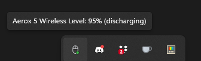
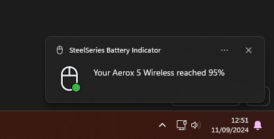

# SteelSeries Battery Indicator

The battery indicator is a utility that sits in your notification tray and reads your SteelSeries wireless mouse battery status.

It will eventually send notifications that your battery is about to run out.

## Supported Mice

- Aerox 3
- Aerox 5
- Aerox 9
- Prime Mini
- Prime
- Rival 3

## Special Thanks

[rivalcfg](https://github.com/flozz/rivalcfg) for already figuring out all HID reports necessary

## How do I install it?

You can safely delete the `pdb` file.
<video src="https://github.com/user-attachments/assets/795dd5fb-1703-4a22-b0e2-4db260578bd1" />  
